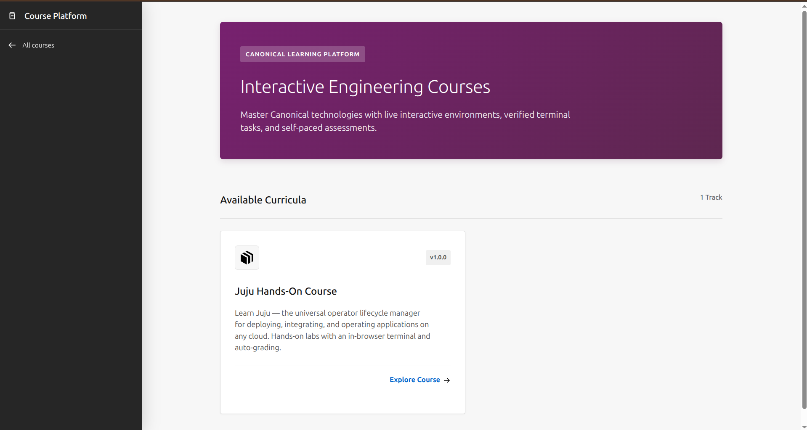
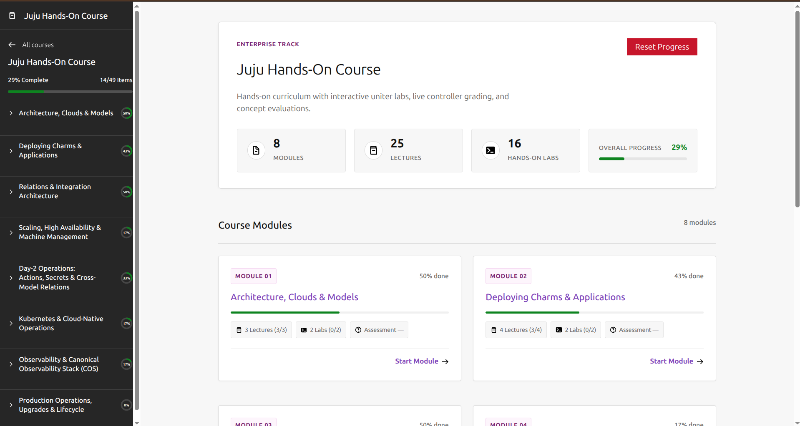
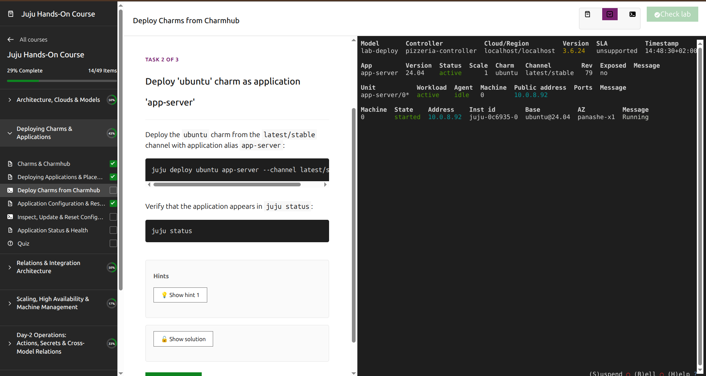
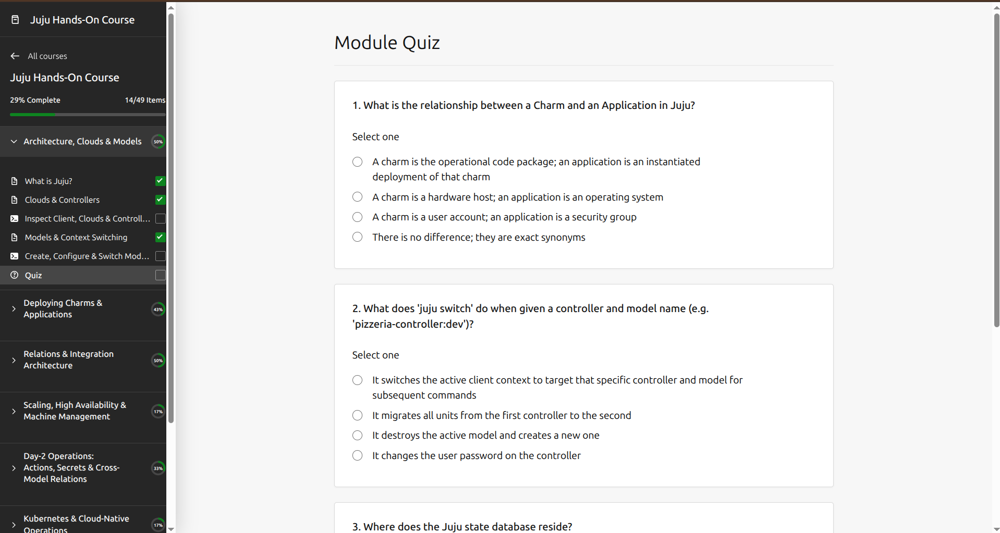

<<<<<<< HEAD
# Juju Hands-On Course

An open-source, fully-local interactive course platform for learning [Juju](https://juju.is) — modeled on the KodeKloud pedagogy (notes → quiz → hands-on lab with auto-grading) and built on Canonical's stack.
=======
# LXD Hands-On Course

An open-source, fully-local course platform for learning [LXD](https://canonical.com/lxd) — Canonical's system container and virtual machine manager. Built on Canonical's stack with an in-browser terminal, auto-graded labs, and interleaved lecture-lab flow.
>>>>>>> origin/main

## What this is

A comprehensive, hands-on enterprise training curriculum for Juju 3.x+ where learners:

<<<<<<< HEAD
1. **Read lecture notes** in a modern Canonical Design System UI
2. **Take quizzes** to check understanding with instant scoring and explanations
3. **Do hands-on labs** in an in-browser workspace (terminal + code editor + task verification) — no leaving the browser
4. **Get auto-graded** by running real `juju` and system commands against a real Juju controller on LXD

Everything runs **locally on the learner's machine** — no cloud, no remote hosting. The Workshop environment bundles the frontend, backend, and lab environment (Juju + LXD) as services that auto-start seamlessly.

## Screenshots

### Course Overview & Progress Dashboard


### In-Depth Interactive Lectures


### Split-Pane Hands-On Lab Workspace


### Knowledge Check Quizzes with Instant Grading


## Quick start

### Running with Taskfile (Recommended)

Requires Ubuntu 22.04+ (or any Linux/Mac environment with Go, Node/Bun, and LXD).

```bash
# Clone the repository
git clone https://github.com/panasheMuriro/learning-platform.git
cd learning-platform

# Install task runner (once)
sudo snap install task --classic

# Install dependencies (Go modules + frontend dependencies)
task install

# Run the platform (Vite dev server on :3000, Go backend on :9090)
task dev
```

Open your browser at `http://localhost:3000`.
=======
1. **Read lecture notes** with diagrams and code examples in a browser UI
2. **Take quizzes** (single-choice, multi-choice, text-answer) to check understanding
3. **Do hands-on labs** in an in-browser terminal — real `lxc` commands against a real LXD daemon, no leaving the browser
4. **Get auto-graded** by check scripts that run real `lxc` commands and verify results

Everything runs **locally on the learner's machine** — no cloud, no remote hosting. The in-browser terminal connects via WebSocket to a PTY shell on the host where LXD is installed.
>>>>>>> origin/main

From there: read notes, take quizzes, open a lab, execute commands in the in-browser terminal, click **Check** to verify each task — all without leaving the browser.

### Production mode

```bash
# Build and run single-port server (:9090 serves frontend + API)
task prod
```

### Canonical Workshop SDK (Experimental / In Development)

Packaging the platform as a self-contained [Canonical Workshop](https://github.com/canonical/workshop) SDK (`workshop launch`) is currently experimental and under active development. For the best experience right now, use `task dev` or `task prod` as shown above.

## Development & Testing

> Requires Ubuntu 22.04+ with LXD installed, Go 1.22+, Bun, and Docker.

```bash
# Install go-task (once)
sudo snap install task --classic

# Install dependencies
task install

# Run in dev mode (Vite hot-reload on :3000, backend on :9090, code-server on :8081)
task dev

# Build + run in production mode (single port :9090 serves everything)
task prod

# Stop all services
task stop
```

From there: read notes, take quizzes, open a lab, type CLI commands in the in-browser terminal or edit files in code-server, click **Check** — all without leaving the browser.

## Repository layout

```
.
├── platform/
│   ├── frontend/      # React 19 + Vite + Canonical Vanilla Framework & @canonical/react-components
│   ├── backend/       # Go API server (content, quiz, file API, PTY, grading, progress)
│   └── code-server/   # Custom code-server container definition (for file-editing courses)
├── workshop/          # Canonical Workshop SDK (bundles everything for `workshop launch`)
├── content/
│   └── courses/
│       ├── juju/      # Juju course: 8 modules of lecture notes, quizzes, labs, and checkers
│       └── lxd/       # LXD course: 5 modules of lecture notes, quizzes, labs (Markdown + check.sh)
├── docs/              # Architecture, lab authoring guide, learner setup, screenshots
├── Taskfile.yml       # All build/dev/prod/lint/test commands (see `task --list-all`)
├── start-prod.sh      # Standalone production startup script (wrapped by `task prod`)
└── .github/           # CI workflows
```

## Tech stack

| Layer | Technology |
|---|---|
| Frontend | React 19, Vite, TypeScript, [Vanilla Framework](https://vanillaframework.io) + [@canonical/react-components](https://github.com/canonical/react-components) (Canonical Design System aligned), [xterm.js](https://xtermjs.org/) |
| Lab editor/terminal | [code-server](https://github.com/coder/code-server) & in-browser WebSocket PTY terminal |
| Backend | Go 1.23 (REST + WebSocket + JSON checker grading), serves built frontend in production |
| Lab environment | [Canonical Workshop](https://github.com/canonical/workshop) + LXD + Juju 3.x+ |
| Lab cloud | LXD (native, per-learner) |
| Progress store | SQLite / PostgreSQL (local, persistent progress) |
| Task runner | [Taskfile](https://taskfile.dev) |

## Course structure

The platform supports multiple courses discovered automatically from `content/courses/`:

### Juju Hands-On Course (`content/courses/juju`)
8 comprehensive enterprise modules covering the complete Juju lifecycle:

1. **Module 1: Architecture, Clouds & Models** — Concepts, client/controller architecture, cloud credentials, model lifecycles, and context switching.
2. **Module 2: Deploying Charms & Applications** — Charmhub ecosystem, application deployment, channels, placement, and configuration.
3. **Module 3: Relations & Integration Architecture** — Endpoints, interfaces, relation data exchange, cross-application integration, and lifecycle hooks.
4. **Module 4: Scaling, High Availability & Machine Management** — Unit scaling, machine provisioning, constraints, spaces, and storage pools.
5. **Module 5: Day-2 Operations: Actions, Secrets & Cross-Model Relations** — Executing actions, Juju 3.x+ managed secrets lifecycle, and cross-model offers (CMR).
6. **Module 6: Kubernetes & Cloud-Native Operations** — K8s cloud bootstrapping, sidecar charms, Pebble containers, and k8s resources.
7. **Module 7: Observability & Canonical Observability Stack (COS)** — Logging, COS Lite integrations (Prometheus, Loki, Grafana), metrics, and troubleshooting.
8. **Module 8: Production Operations, Upgrades & Lifecycle** — Charm refresh, Juju agent upgrades, controller backup/restore, and model migration.

### LXD Course (`content/courses/lxd`)
5 modules covering Linux Containers with interleaved lectures and CLI labs:

| Module | Topics | Labs |
|--------|--------|------|
| **01 — Getting Started** | What is LXD, install & init, first instance | Install & Initialize, Launch First Container |
| **02 — Managing Instances** | Creating containers/VMs, configuring, shell & exec, files & snapshots | Create & Configure, Shell & Exec, Files & Snapshots |
| **03 — Images** | Remote image servers, local image management, creating images | Explore Remote Images, Manage Local Images, Publish Custom Image |
| **04 — Storage** | Storage pools & drivers, custom volumes | Explore Storage Pools, Custom Volumes |
| **05 — Networking** | Bridge networks, instance networking | Bridge Networks, Instance Networking |

## Per-course workspace type

Courses can declare `"workspace": "terminal"` or `"workspace": "code-server"` in `course.json`. The LXD course uses the in-browser terminal (CLI-based labs). Courses with code editing (e.g. Juju configuration or Terraform) can use code-server.

## Licensing

- **Code** (everything under `platform/`): Apache-2.0 — see [LICENSE](LICENSE)
- **Content** (everything under `content/`): CC-BY-SA 4.0

## Contributing

<<<<<<< HEAD
See [CONTRIBUTING.md](CONTRIBUTING.md). Content contributions (notes, quizzes, labs) are welcome.

## Status

✅ **Curriculum Complete** — All 8 Juju modules (25 lectures, 16 hands-on labs, 33 quizzes) are fully authored and functional in dev and production modes.
=======
See [CONTRIBUTING.md](CONTRIBUTING.md). Content contributions (notes, quizzes, labs) are especially welcome.
>>>>>>> origin/main
