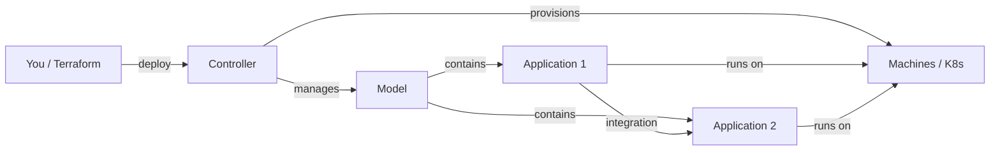

# What is Juju?

Juju is Canonical's open-source **Operator Lifecycle Manager (OLM)**. It deploys,
configures, scales, and operates applications on any cloud — using reusable
operators called **charms**.

## Key concepts

| Concept | Description |
|---------|-------------|
| **Controller** | The brain — manages models, applications, and machines. You bootstrap one per cloud. |
| **Model** | A workspace/namespace for applications. Like a Kubernetes namespace. |
| **Application** | A deployed charm (e.g., PostgreSQL, WordPress). One charm = one application. |
| **Unit** | A running instance of an application. Scale by adding units. |
| **Machine** | A VM or container where units run. Juju provisions these. |
| **Charm** | A reusable operator (software + logic) that knows how to deploy and manage an application. |
| **Channel** | A charm's release track (e.g., `latest/stable`, `14/stable`). |
| **Integration** | A relation between two applications (e.g., WordPress ↔ database). |

## How Juju works

1. You **bootstrap** a controller on a cloud (e.g., LXD, AWS, MicroK8s)
2. You create a **model** (a workspace)
3. You **deploy** charms into the model
4. Juju **provisions machines** (or K8s pods) and runs the applications
5. You add **integrations** between applications
6. Juju continuously **operates** the applications (scaling, upgrades, config)

## Charms and Charmhub

Charms are published to [Charmhub](https://charmhub.io) — a marketplace for
operators. You can browse, deploy, and integrate charms for databases
(PostgreSQL, MySQL, MongoDB), web apps (WordPress), observability
(Prometheus, Grafana, Loki), and much more.

## Juju vs. Terraform

| | Juju | Terraform |
|---|---|---|
| **What it manages** | Application lifecycle (deploy, configure, operate, integrate) | Infrastructure (VMs, networks, storage, cloud resources) |
| **How** | Charms (operators that run continuously) | HCL configs applied once (declarative state) |
| **State** | Controller holds state | `terraform.tfstate` file |
| **Best for** | Operating applications day-1 and day-2+ | Provisioning infrastructure day-0 |

**They're complementary**: Terraform provisions the infrastructure, Juju operates
the applications on top. The Juju Terraform provider lets you manage Juju resources
(models, applications, integrations) declaratively with Terraform.

## Next steps

In the next lecture, we'll look at Terraform basics and HCL syntax. Then we'll
combine them with the Juju Terraform provider.
