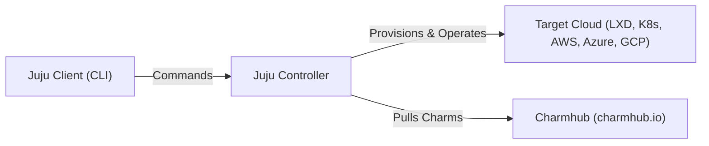

# What is Juju?

**Juju** is an open source orchestration engine and universal operator lifecycle manager developed by Canonical. It allows you to deploy, configure, integrate, scale, and manage complex multi-cloud applications using **Charms**.

---

## Core Concepts

### 1. Application-Centric Modeling
Unlike low-level infrastructure managers that focus on individual virtual machines, containers, or IP addresses, Juju models complete distributed topologies as high-level applications and relations.

- **Charm**: An executable package encapsulating application operational logic (installation, configuration, integration, backup, recovery, and scaling).
- **Application**: A deployed instance of a charm (e.g., `postgresql` or `mattermost`).
- **Unit**: An individual runtime replica or process belonging to an application (e.g., `postgresql/0`, `postgresql/1`).
- **Relation / Integration**: A managed communication channel and configuration protocol connecting two applications (e.g., connecting a web frontend to a database).

---

## The Juju Architecture

Juju operates using three main components:

1. **Juju Client**: The CLI tool (`juju`) running on your local machine used to send commands to the controller.
2. **Juju Controller**: The central management agent and state database (MongoDB) running in a target cloud that manages infrastructure provisioning, unit state, and charm lifecycle events.
3. **Juju Agents**: Lightweight background daemons (`jujud`) running inside every machine and container unit, listening for state changes and executing charm lifecycle hooks.

---

## Key Benefits

- **Cloud Agnostic**: Write your deployment topology once and deploy across Kubernetes, bare metal, LXD, OpenStack, AWS, Azure, and Google Cloud.
- **Reusable Operations**: Charms embed expert Day-2 operational knowledge directly into code.
- **Declarative Integrations**: Connect complex services with simple commands rather than manual configuration files.
