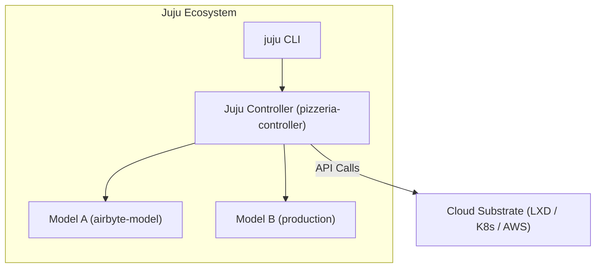

# Clouds & Controllers

To deploy applications with Juju, the Juju client connects to a **cloud** and bootstraps a **controller**.



---

## 1. Juju Clouds

A **cloud** in Juju represents any infrastructure target that provides compute, networking, and storage APIs:

- **Localhost clouds**: Local system containers (LXD) or local Kubernetes (MicroK8s).
- **Public clouds**: AWS, Azure, Google Cloud (GCP), Oracle OCI.
- **Private infrastructure**: MAAS (Metal as a Service), OpenStack.

You can inspect all clouds known to your client using:

```bash
juju clouds
```

---

## 2. Bootstrapping a Controller

Bootstrapping creates the initial controller instance in your target cloud. Once bootstrapped, the controller runs continuously and manages your models:

```bash
juju bootstrap localhost <controller-name>
```

To list all controllers registered with your client:

```bash
juju controllers
```

To inspect the details of the active controller:

```bash
juju show-controller
```
