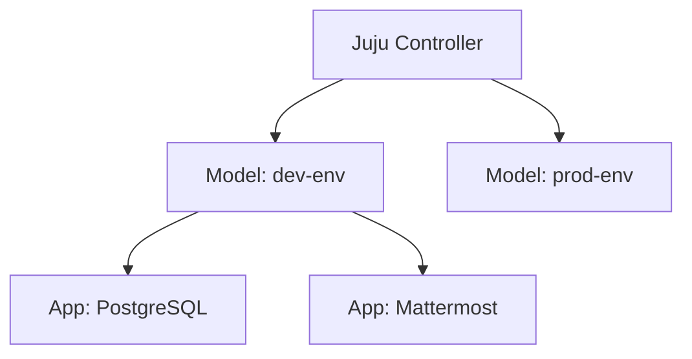

# Models & Context Switching

In Juju, a **Model** is a dedicated environment (workspace) inside a controller where applications, units, machines, and relations live.



---

## 1. Creating Models

You create a model inside your active controller with:

```bash
juju add-model <model-name>
```

When you add a model, Juju automatically switches your client's active context to this newly created model.

---

## 2. Listing and Switching Models

To list all models on the controller:

```bash
juju models
```

The asterisk `*` next to a model name indicates your current active model.

To switch between models or controllers:

```bash
juju switch <model-name>
# Or specify controller and model:
juju switch <controller>:<model-name>
```

---

## 3. Configuring Models

Each model has attributes such as logging levels, update status intervals, and network proxy settings.

- Inspect configuration:
  ```bash
  juju model-config
  ```
- Set a configuration value:
  ```bash
  juju model-config logging-config="<root>=INFO"
  ```
- Reset a configuration key back to default:
  ```bash
  juju model-config --reset logging-config
  ```
