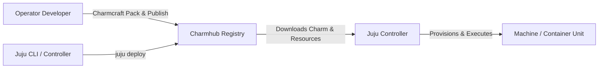

# Charms & Charmhub

Charms are universal software operators that package applications and their operational knowledge (lifecycle, configuration, scale-out, relations, and day-2 tasks).

## What is Charmhub?

**Charmhub** ([charmhub.io](https://charmhub.io)) is the official open repository and registry for Juju charms and bundles. When you run `juju deploy <charm>`, Juju resolves the charm package from Charmhub.



## Charm Anatomy & Structure

A charm typically contains:
- `metadata.yaml` or `charmcraft.yaml`: Defines charm name, summary, description, supported operating system bases, and provided/required relation endpoints.
- `config.yaml`: Defines user-configurable options, defaults, and data types (string, boolean, int, float, secret).
- `actions.yaml`: Defines Day-2 operational commands (e.g. `backup`, `restore`, `vacuum`).
- `src/charm.py`: Python operator code utilizing the **Ops Framework** (`ops`) that handles events and drives system configuration.

## Channels, Tracks & Risk Levels

Charms in Charmhub are released across **channels**. A channel is specified as `<track>/<risk-level>`:

| Component | Description | Example |
| :--- | :--- | :--- |
| **Track** | Major software series or version stream | `latest`, `24.04`, `8.0` |
| **Risk** | Stability / readiness level | `stable`, `candidate`, `beta`, `edge` |

### Channel Progression
1. `edge`: Continuous builds with newest features.
2. `beta`: Feature-complete builds undergoing validation.
3. `candidate`: Release candidates ready for final smoke tests.
4. `stable`: Production-grade releases tested against real workloads.

```bash
# Search for charms in Charmhub
juju find postgresql
juju info ubuntu
```

```bash
# Deploy with a specific channel
juju deploy ubuntu --channel latest/stable
```

## Charm Revisions & Resources

- **Revision**: Each published charm release receives a sequential numeric revision integer (e.g. `rev 79`).
- **Resources**: Additional binary artifacts, OCI images, or tarballs associated with the charm, versioned and attached dynamically during deploy or update.
