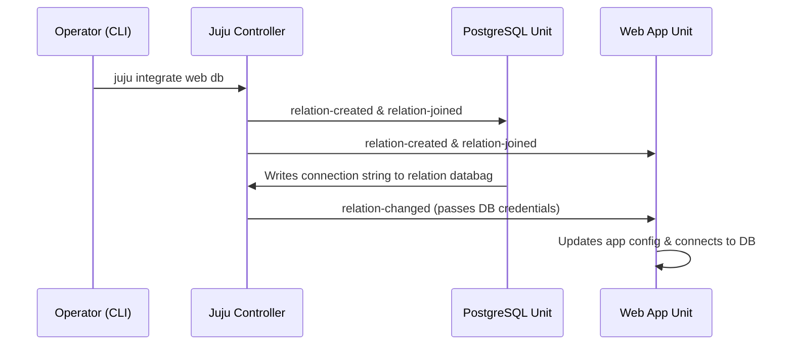

# Relation Data & Event Lifecycle

When relations are created, modified, or destroyed, Juju drives the integration through structured lifecycle events and relation databags.

## Relation Databags

Every relation maintains partitioned key-value storage managed by the Juju controller called **relation databags**:
- **Application Databag**: Shared across all units of the application (e.g. global service address, database credentials).
- **Unit Databag**: Scoped to an individual unit (e.g. unit IP address, private key, cluster rank).

## The Relation Event Lifecycle

When an integration is formed, the following sequence of events executes on participating units:

1. **`relation-created`**: Fired once when the relation is first registered.
2. **`relation-joined`**: Fired when a specific unit enters the relation.
3. **`relation-changed`**: Fired whenever the remote unit or application writes or modifies keys in its relation databag.
4. **`relation-departed`**: Fired when a unit leaves the relation (e.g. during scale-in or unit destruction).
5. **`relation-broken`**: Fired when the relation is completely severed across applications.

## Peer Relations

Peer relations occur between units of the same application (e.g. `cluster` peer endpoint). They enable:
- Electing a cluster leader (`juju-is-leader` / Ops `unit.is_leader()`).
- Sharing replication state, tokens, and cluster topology without an external consensus coordinator.
