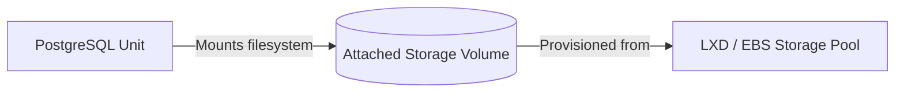

# Storage Management & Storage Pools

Stateful applications (such as databases, distributed file systems, and message queues) require durable persistent storage independent of machine lifecycles.

## Storage Concepts in Juju

- **Storage Pool**: A defined storage backend provider (e.g. `lxd`, `ebs`, `ceph`, `tmpfs`, `rootfs`).
- **Storage Directives (`--storage`)**: Declares storage volume requirements (pool, size, count) during charm deployment.
- **Volume / Filesystem**: Block storage devices or mounted file systems dynamically provisioned by Juju and attached to units.



## Listing Storage Pools (`juju storage-pools`)

To view storage providers configured in your cloud/model:

```bash
juju storage-pools
```

## Deploying Charms with Custom Storage

Charms define storage tags in their metadata (e.g. `pgdata`, `data`, `cache`). Operators can customize size and backend during deployment:

```bash
# Request 50GB storage from the default storage pool for tag 'pgdata'
juju deploy postgresql --storage pgdata=50G

# Request storage explicitly from a named storage pool
juju deploy postgresql --storage pgdata=ebs-fast,100G
```

## Inspecting Model Storage (`juju storage`)

To view all allocated storage volumes, their attachments, and status:

```bash
# List all active storage instances
juju storage

# Machine-readable output
juju storage --format json
```
