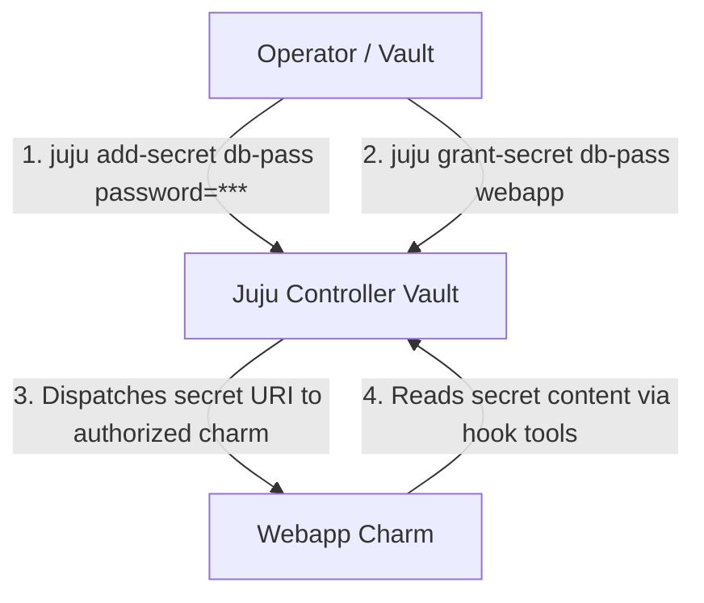

# Secrets Management in Juju 3.x+

Modern applications rely on sensitive credentials (API tokens, private TLS keys, database passwords, OAuth secrets) that must not be stored in cleartext charm configuration or version control.

Juju 3.x introduced a native, controller-managed **Juju Secrets engine** that allows operators to securely store, grant, revoke, and rotate sensitive information without exposing values in configuration files or logs.

## Secrets Architecture

- **Secret Owner / Creator**: The operator (or charm) that adds the secret to Juju with a URI like `secret:c9v...`.
- **Access Control (`grant` / `revoke`)**: Explicit role-based grants dictating which applications can read the secret content.
- **Rotation / Revisions**: Secrets can be updated with new revisions; Juju automatically triggers secret-changed events on authorized charms.



## Adding Secrets (`juju add-secret`)

You can create secrets from key-value pairs or files:

```bash
# Add a secret with key-value pairs
juju add-secret db-creds username=admin password=SecretPassword123

# Add a secret from a private certificate file
juju add-secret tls-key value="$(cat server.key)"
```

Juju outputs a unique URI:
```text
secret:cm4vbg613tcc930u2j90
```

## Listing Secrets (`juju list-secrets` / `juju secrets`)

To view all secrets in the current model:

```bash
juju secrets
# or
juju list-secrets
```

## Granting Access (`juju grant-secret`)

Applications cannot read secret content until explicitly granted permission:

```bash
# Grant application 'my-app' permission to access secret 'db-creds'
juju grant-secret db-creds my-app
```

## Passing Secrets to Applications

Charms accepting secrets define config parameters expecting secret URIs:

```bash
juju config my-app credentials=secret:cm4vbg613tcc930u2j90
```

## Updating and Rotating Secrets (`juju update-secret`)

When credentials expire or rotate, update the secret revision:

```bash
juju update-secret db-creds password=NewSuperSecret456
```

Juju dispatches a `secret-changed` event to all granted applications, allowing charms to reload credentials dynamically without downtime.
