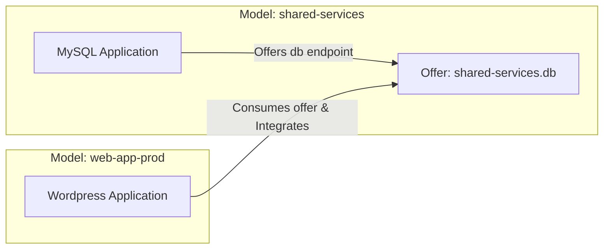

# Cross-Model Relations (CMR) & Application Offers

In enterprise deployments, applications often reside in separate models or even across separate clouds and controllers. For example, a central database or logging tier in an `infrastructure` model may serve dozens of tenant applications in isolated `project-a`, `project-b` models.

**Cross-Model Relations (CMR)** allow Juju operators to securely connect applications across model, controller, and cloud boundaries using **Application Offers**.



## Step 1: Create an Application Offer (`juju offer`)

In the provider model, an operator exposes a charm endpoint as a shareable offer:

```bash
# Switch to the provider model
juju switch shared-services

# Offer the 'db' endpoint of MySQL
juju offer mysql:db db-offer
```

To list active offers:
```bash
juju list-offers
```

## Step 2: Grant Read/Consume Permissions (Optional/Multi-User)

If the consumer is a different Juju user or on another controller:

```bash
juju grant-offer alice consume db-offer
```

## Step 3: Consume and Integrate the Offer (`juju consume` & `juju integrate`)

In the consumer model, an operator consumes the remote endpoint and establishes the integration:

```bash
# Switch to the consumer model
juju switch web-app-prod

# Consume the offer (creates a local proxy endpoint)
juju consume shared-services.db-offer

# Integrate local application with the consumed offer
juju integrate wordpress:db db-offer
```

Alternatively, `juju integrate` can consume and relate in a single command:
```bash
juju integrate wordpress:db shared-services.db-offer
```

## Inspecting CMR Integrations

Run `juju status` in either model to see the cross-model connection indicated under SAAS (Software as a Service) / Offers section.
