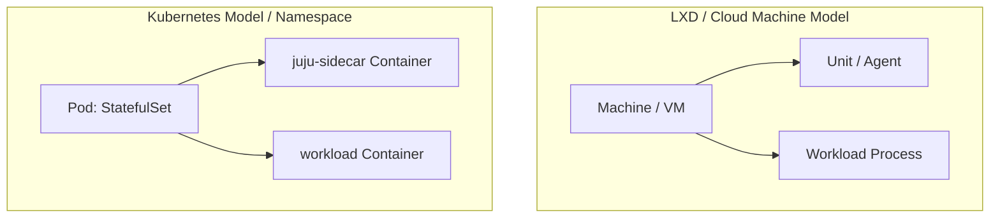

# Juju on Kubernetes & MicroK8s

While Juju excels at bare-metal and machine orchestration, it provides first-class native Kubernetes operator management. In a Kubernetes substrate, Juju manages Pods, StatefulSets, and Service accounts directly using K8s native APIs.

## Architecture: Machine vs Kubernetes Juju



- **Machine models**: Each unit runs on a dedicated VM, bare metal node, or LXD container.
- **K8s models**: Each Juju model corresponds to a Kubernetes **namespace**. Each unit corresponds to a **Pod** running a Juju sidecar container alongside workload containers (Pebble).

## Adding a Kubernetes Cloud to Juju

To register an existing Kubernetes cluster with Juju:

```bash
# Add Kubernetes cloud using local kubeconfig
juju add-k8s k8s-cloud

# For MicroK8s specifically:
microk8s config | juju add-k8s microk8s-cloud --client
```

## Bootstrapping a Controller on Kubernetes

You can bootstrap a Juju controller directly inside Kubernetes:

```bash
juju bootstrap microk8s-cloud k8s-controller
```

Or you can use a machine-based controller to manage Kubernetes models by adding credentials to the controller:

```bash
juju add-k8s microk8s-cloud --controller pizzeria-controller
```

## Creating Kubernetes Models (`add-model`)

```bash
# Creates a namespace named 'k8s-prod' in Kubernetes
juju add-model k8s-prod microk8s-cloud
```
