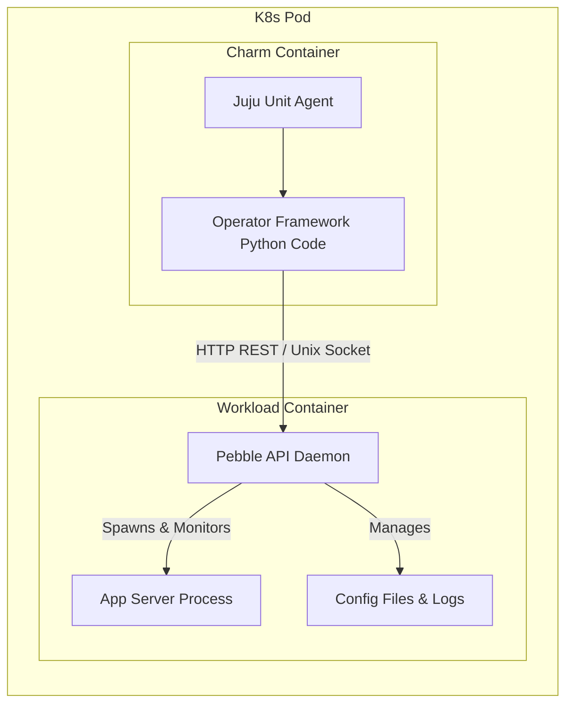

# Sidecar Charms & Pebble

In Kubernetes environments, modern charms use the **Sidecar Pattern**. Rather than executing hooks inside the same container as the main workload process, Juju deploys a lightweight process manager named **Pebble** in the application container and manages it through the charm sidecar container.

## Architecture: The Sidecar Pattern



## What is Pebble?

[Pebble](https://github.com/canonical/pebble) is a lightweight, API-driven process manager designed for container environments. It provides:
- Service management (start, stop, restart, plan definitions).
- Layered configuration plans (`pebble plan`, `pebble-layer.yaml`).
- File transfer (push configuration files, pull log files).
- Process execution (`pebble exec`).

## Interacting with Containers (`juju ssh --container` & `juju exec`)

Operators and developers can inspect workload containers directly through Juju:

```bash
# Open interactive shell in workload container
juju ssh <app>/0 --container <container-name>

# Inspect pebble plan and services
juju exec --unit <app>/0 --container <container-name> "pebble services"
juju exec --unit <app>/0 --container <container-name> "pebble plan"
```

## Scaling Kubernetes Applications (`scale-application`)

Unlike machine clouds where units are added with `add-unit`, on Kubernetes models you directly set the replica count using `scale-application`:

```bash
# Scale K8s workload Pods to 5 replicas
juju scale-application <app-name> 5
```
