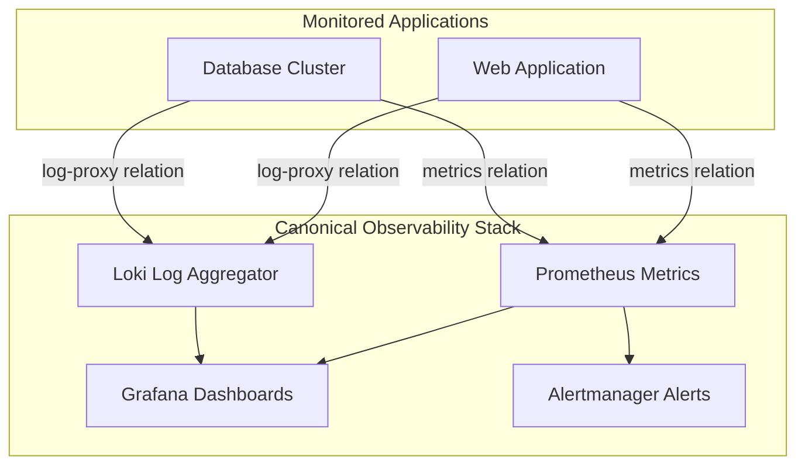

# Observability & Canonical Observability Stack (COS)

Modern cloud-native and machine workloads require deep, real-time visibility into metrics, logs, application traces, and alerts. Canonical provides the **Canonical Observability Stack (COS)** — a cohesive, charm-driven observability suite built from Prometheus, Loki, Grafana, Alertmanager, and Tempo.

## The COS Architecture

In Juju environments, applications do not require manual daemon instrumentation or complex monitoring proxies. Instead, charms integrate with COS via standard Juju relations.



## How Charms Export Telemetry

Charms use standard interface endpoints in `charmcraft.yaml` or `metadata.yaml`:
- **`metrics-endpoint`**: Scrapes Prometheus metrics endpoints exported by charm units.
- **`log-proxy` / `logging`**: Streams container and system logs to Loki.
- **`grafana-dashboard`**: Ships pre-built, version-controlled JSON Grafana dashboards directly into Grafana.
- **`alert-rules`**: Ships Prometheus alert rules automatically without manually editing server configuration files.

## Integrating an Application with COS

Connecting an application to COS requires standard Juju integration commands:

```bash
# Relate metrics endpoint to Prometheus
juju integrate webapp:metrics-endpoint prometheus:metrics-endpoint

# Relate log stream to Loki
juju integrate webapp:logging loki:logging

# Provide Grafana dashboard templates
juju integrate webapp:grafana-dashboard grafana:grafana-dashboard
```
