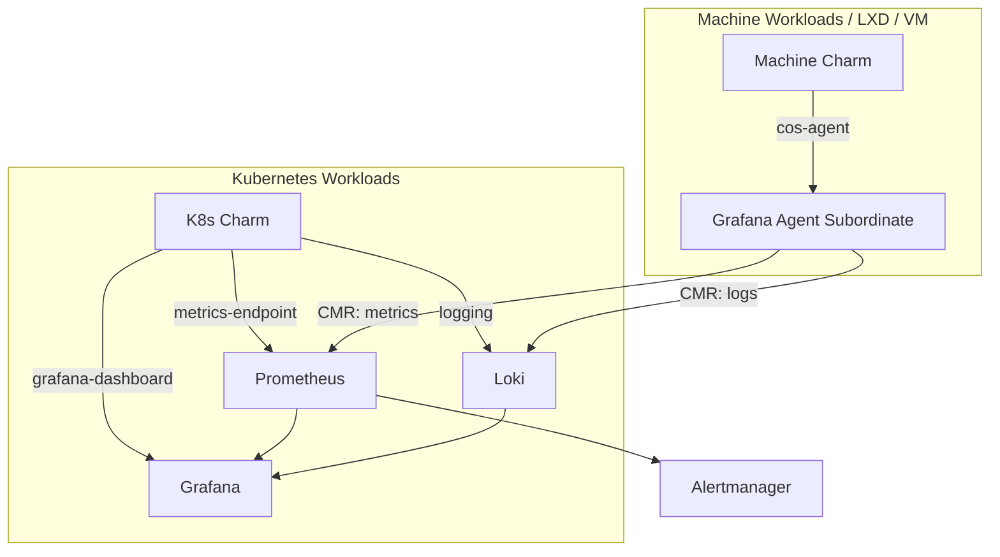

# Observability & Canonical Observability Stack (COS)

Modern cloud-native and machine workloads require deep, real-time visibility into metrics, logs, application traces, and alerts. Canonical provides the **Canonical Observability Stack (COS)** — a cohesive, charm-driven observability suite built from Prometheus, Loki, Grafana, Alertmanager, and Tempo.

## The COS Architecture

In Juju environments, applications do not require manual daemon instrumentation or complex monitoring proxies. Instead, charms integrate with COS via standard Juju relations.



## Machine Observability with Grafana Agent

While Kubernetes charms can communicate directly with COS components over HTTP endpoints, machine charms (running on bare metal, LXD, or cloud VMs) typically leverage **`grafana-agent`** deployed as a subordinate charm:

1. **Subordinate Deployment**: `grafana-agent` runs directly on the principal machine unit.
2. **Local Scraping**: It scrapes `localhost` Prometheus metrics and tails `/var/log/` system and application logs locally.
3. **Remote Write & Ingestion**: It forwards gathered metrics and logs over Cross-Model Relations (CMR) to a centralized COS model.

```bash
# Deploy grafana-agent on machines
juju deploy grafana-agent

# Relate grafana-agent as a subordinate to your workload charm
juju integrate webapp:cos-agent grafana-agent:cos-agent
```

## How Charms Export Telemetry

Charms use standardized interface endpoints in `charmcraft.yaml` or `metadata.yaml`:
- **`metrics-endpoint`**: Scrapes Prometheus metrics endpoints exported by charm units.
- **`logging` / `log-proxy`**: Streams container and system logs to Loki.
- **`grafana-dashboard`**: Ships pre-packaged, version-controlled JSON Grafana dashboards directly into Grafana.
- **`alert-rules`**: Ships Prometheus alert rules automatically without manually editing server configuration files.

## Integrating an Application with COS

Connecting a workload model to a centralized `cos` model via Cross-Model Relations:

```bash
# Offer Prometheus metrics receiver endpoint in the cos model
juju offer -m cos prometheus:metrics-endpoint

# Relate workload application to the offer
juju integrate -m prod webapp:metrics-endpoint admin/cos.prometheus
```

