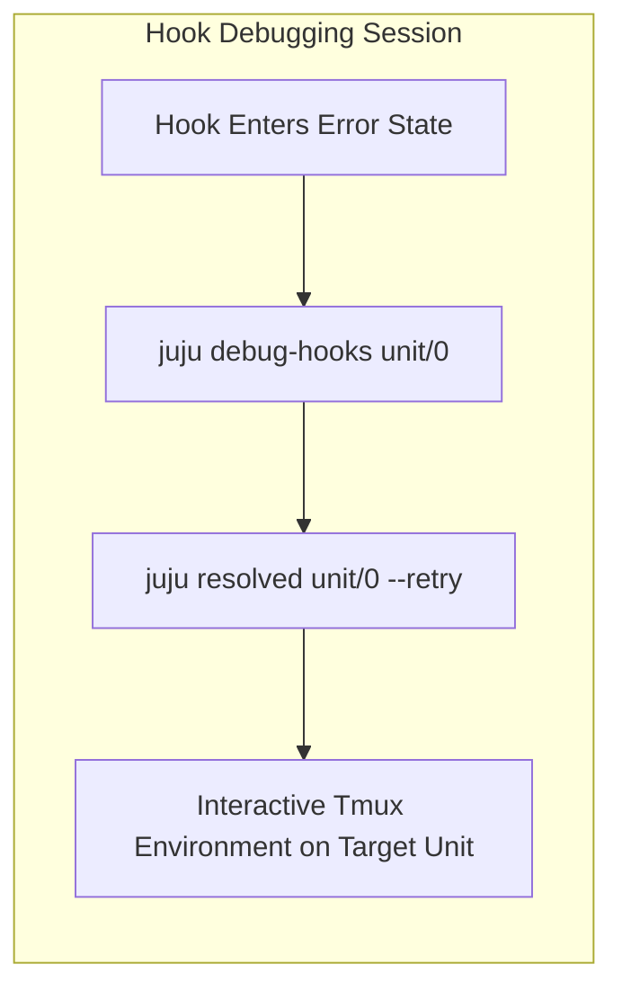

# Advanced Juju Logging & Debugging

When operating complex systems or troubleshooting charm hook execution, Juju provides rich, structured logging and interactive debugging facilities.

## Juju Debug Logs (`juju debug-log`)

The `debug-log` command streams real-time log entries from controller and unit agents across models.

```bash
# Stream logs for the active model
juju debug-log

# Filter logs for a specific application
juju debug-log --include webapp

# Filter logs for a specific unit
juju debug-log --include webapp/0

# Limit logs to specific log levels (e.g. WARNING, ERROR, DEBUG, TRACE)
juju debug-log --level DEBUG
```

## Configuring Model and Unit Logging Levels

Log verbosity can be tuned dynamically without restarting services:

```bash
# Set global logging level on a model
juju model-config logging-config="<root>=DEBUG"

# Target specific charm subsystems (e.g. juju.worker.uniter)
juju model-config logging-config="<root>=INFO;unit=DEBUG;juju.worker.uniter=TRACE"
```

## Interactive Hook Debugging (`juju debug-hooks`)

When a charm hook encounters an unhandled error or hook failure, Juju enters a `hook-failed` error state. Developers and operators can interactively step through and debug the hook execution in real time:

```bash
# Interactively intercept hook executions for a unit
juju debug-hooks <application>/<unit>

# In another terminal, retry the failed hook
juju resolved <application>/<unit> --retry
```

When the hook triggers, Juju opens an interactive tmux session directly inside the unit environment with all hook context variables exported.



## Inspecting Unit Agents & Tasks

```bash
# Show status including agent status messages
juju status --format yaml

# Inspect machine-level agent logs directly
juju ssh <app>/0 "sudo cat /var/log/juju/unit-*.log"
```
