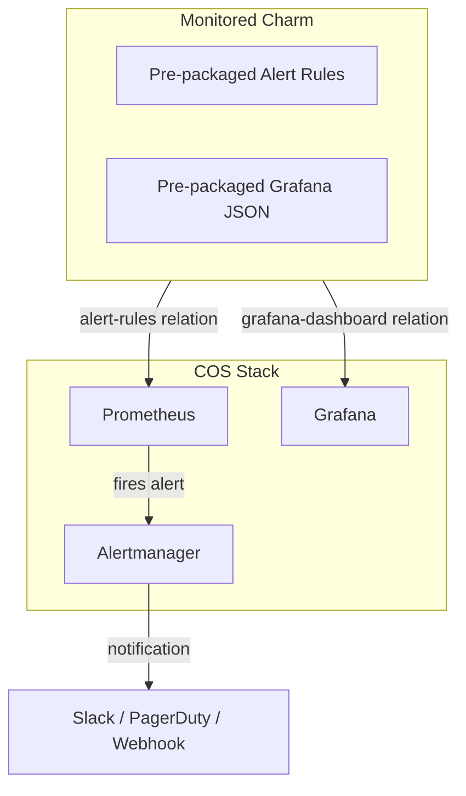
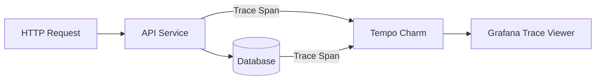

# Alerting, Dashboards & Telemetry Pipelines

Reliable observability requires turning raw telemetry into actionable alerting rules, unified dashboards, and traces across distributed services.

## Automated Alert Rules with COS

Charms encapsulate their own alerting thresholds (such as high memory, connection pool exhaustion, or replication lag) directly inside the charm source code under `src/prometheus_alert_rules/`:

```yaml
# Example charm alert rule (e.g., high_cpu.rule)
groups:
  - name: WorkloadAlerts
    rules:
      - alert: HighMemoryUsage
        expr: process_resident_memory_bytes > 1e9
        for: 5m
        labels:
          severity: critical
        annotations:
          summary: "Instance {{ $labels.juju_unit }} is using excessive memory"
```



When you relate a charm to Prometheus using `metrics-endpoint` or `alert-rules`, Prometheus automatically evaluates and registers these rules without manual intervention.

## Grafana Dashboard Provisioning

1. Charms ship JSON dashboard definitions inside the charm repository under `src/grafana_dashboards/`.
2. When the `grafana-dashboard` relation is established:
   - Grafana receives the dashboard template payload via Juju relation event handlers.
   - Dashboards are dynamically imported into Grafana folders organized by Juju model and application name.
   - When charms update or scale, the dashboards automatically adjust metric queries to include newly provisioned units.

## Distributed Tracing with Tempo

In microservices architectures, tracing requests across service boundaries is handled by Grafana Tempo or OpenTelemetry collectors:
- Applications export OTLP/Zipkin traces to the Tempo charm.
- Tempo links traces to Loki logs and Prometheus metrics in Grafana via trace IDs.



## Production Observability Best Practices

- **Cross-Model COS**: Deploy COS in a dedicated `cos` model or Kubernetes cluster and monitor multiple workload models using Cross-Model Relations (CMR).
- **Log Rate Limiting**: Configure rate limits on Loki relations to avoid storage exhaustion during high-traffic incidents.
- **Alert Routing**: Group Alertmanager receivers by workload tier (e.g. database alerts to DBA rotation, ingress alerts to SRE).

