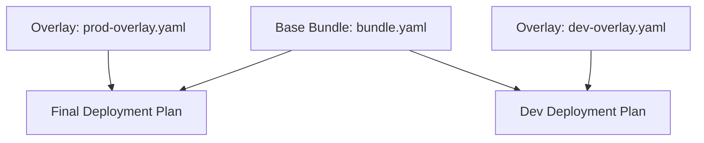

# Juju Bundles & Declarative Overlays

In enterprise environments, deploying complex multi-application topologies manually one command at a time is error-prone and difficult to replicate. Juju solves this through **Bundles** and **Bundle Overlays** — declarative YAML specifications that capture an entire system topology, including applications, charm channels, configuration settings, resource constraints, machine placements, and integration relations.

## What is a Juju Bundle?

A Juju bundle is a YAML document (`bundle.yaml`) that describes the desired state of a deployment:

```yaml
bundle: kubernetes # or 'charmed' for machine bundles
applications:
  wordpress:
    charm: wordpress
    channel: latest/stable
    scale: 2
    options:
      blog_title: "Production Blog"
  mysql:
    charm: mysql
    channel: 8.0/stable
    scale: 1
    options:
      database: wordpress_db
relations:
  - [wordpress:db, mysql:database]
```

## Deploying Bundles

You deploy bundles directly from Charmhub or from local files:

```bash
# Deploy a curated bundle from Charmhub
juju deploy canonical-observability-stack

# Deploy a local bundle YAML file
juju deploy ./bundle.yaml

# Deploy into a specific model
juju deploy ./bundle.yaml -m production
```

## Bundle Overlays for Environment Customization

Overlays allow operators to maintain a base bundle while overriding configuration, scale, or placement across development, staging, and production environments without duplicating the entire bundle definition.



### Example: Base Bundle & Production Overlay

**Base Bundle (`bundle.yaml`):**
```yaml
applications:
  web-app:
    charm: ubuntu
    scale: 1
  cache:
    charm: redis-k8s
    scale: 1
```

**Production Overlay (`prod-overlay.yaml`):**
```yaml
applications:
  web-app:
    scale: 3
    options:
      debug: false
  cache:
    scale: 2
```

Deploying with an overlay:

```bash
juju deploy ./bundle.yaml --overlay ./prod-overlay.yaml
```

## Exporting Live Models into Bundles

Juju can inspect an active running model and export its current topology as a reproducible bundle:

```bash
# Export active model topology to bundle YAML
juju export-bundle --filename my-deployment.yaml
```
