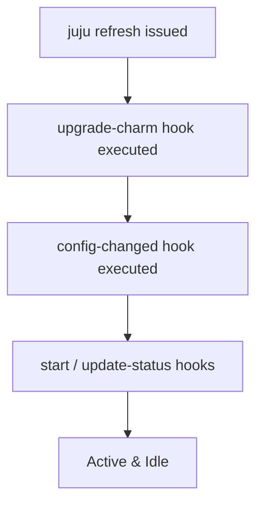
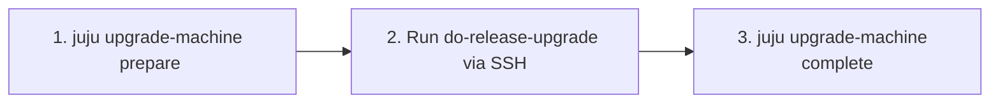

# Upgrades & Charm Evolution

Operating software over long production lifecycles requires reliable upgrade mechanisms for charms, workload configurations, base operating systems, and the Juju agents themselves.

## Upgrading Charms with `juju refresh`

When charm authors publish revisions, bug fixes, or new major features to Charmhub, operators update deployed applications using `juju refresh`:

```bash
# Refresh an application to the latest revision on its current channel
juju refresh mysql

# Switch tracks or risk channels (e.g. from edge to stable, or to a new track)
juju refresh mysql --channel 8.0/stable

# Switch to a specific revision number
juju refresh mysql --revision 142

# Deploy from a local charm file during development/testing
juju refresh mysql --path ./mysql_ubuntu-22.04-amd64.charm
```

## The Upgrade Event Lifecycle

During a charm refresh, Juju executes a sequence of lifecycle hooks on each unit:



1. **`upgrade-charm`**: Fired when charm code changes. The charm unpacks new assets, migrates schemas or config formats, and prepares state.
2. **`config-changed`**: Runs immediately after `upgrade-charm` to apply any default or modified configuration parameters.
3. **`start`**: Ensures workload processes are running with the new binary or configuration.

## Rolling Unit Upgrades & Coordinated Maintenance

For high-availability clusters (such as PostgreSQL, MySQL InnoDB Cluster, or OpenSearch), updating all units simultaneously would cause service outages.

Modern charms implement coordinated rolling upgrade patterns:
1. The operator issues `juju refresh <app>`.
2. The charm orchestrates an upgrade sequence using peer relations or leadership:
   - Primary/leader marks secondary units for upgrade.
   - Secondary units step through maintenance mode, take themselves out of load balancing, upgrade, and rejoin the cluster.
   - Once secondaries are healthy, leadership fails over and the former primary upgrades.
3. Juju actions (e.g., `juju run <app>/leader pre-upgrade-check` or `resume-upgrade`) may be provided by the charm author for manual gatekeeping.

## Operating System Series Upgrades (`juju upgrade-machine`)

When upgrading the underlying Ubuntu base OS (e.g. Ubuntu 20.04 Focal to Ubuntu 22.04 Jammy):



```bash
# Step 1: Prepare machine for series upgrade (notifies charms to pause workloads)
juju upgrade-machine 0 prepare jammy

# Step 2: SSH into machine and run standard OS upgrade
juju ssh 0
# sudo do-release-upgrade

# Step 3: Complete series upgrade (notifies charms to resume and adapt to new OS)
juju upgrade-machine 0 complete
```

## Upgrading Juju Model and Controller Agents

To upgrade the Juju agent binaries managing your workloads and controllers:

```bash
# Upgrade agents across a specific model to match controller agent version
juju upgrade-model -m production

# Specify a target agent version
juju upgrade-model --agent-version 3.6.27
```
