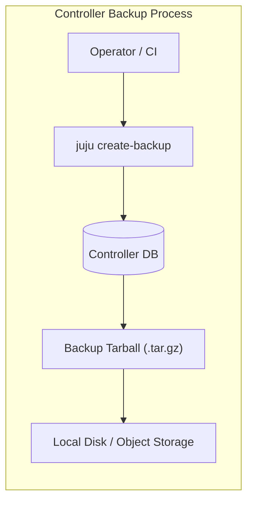
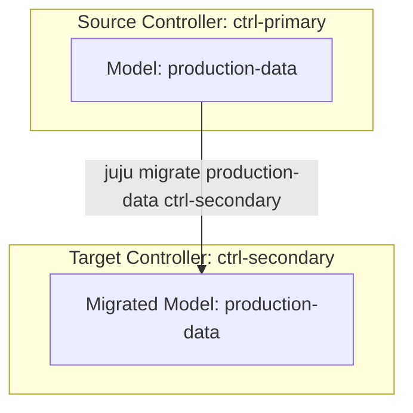

# Backup, Restore & Migration

Protecting production environments requires robust disaster recovery, state backup procedures, and the ability to migrate running models seamlessly between controllers or cloud regions.

## Controller Backups (`juju create-backup`)

The Juju controller stores the complete configuration, agent states, relation data, and secret keys in an internal database. Creating regular backups ensures full disaster recovery capability.

```bash
# Create a backup archive of the active controller (downloads tar.gz locally)
juju create-backup

# Create a backup archive with a specified filename
juju create-backup --filename ./controller-backup.tar.gz

# Create a backup on the controller without downloading immediately
juju create-backup --no-download

# Download a specific backup archive created on the controller
juju download-backup <backup-id> --filename ./controller-backup.tar.gz
```



## Restoring a Controller (`juju restore-backup`)

If a controller host experiences catastrophic hardware failure:

```bash
# Bootstrap a replacement controller or restore directly to an existing host
juju restore-backup ./controller-backup.tar.gz
```

## Live Model Migration (`juju migrate`)

Model migration allows transferring an entire live, running workload model from one controller to another without downtime or redeploying applications.



### The Migration Lifecycle

1. **Validation**: Target controller credentials, cloud compatibility, and model name availability are checked.
2. **State Freeze & Export**: Source controller halts event dispatching momentarily and serializes model database state.
3. **Agent Re-homing**: Unit and machine agents are updated with the target controller's connection endpoints and TLS certificates.
4. **State Import**: Target controller imports the state and resumes event processing seamlessly.

```bash
# Migrate a model to a target controller
juju migrate production-app destination-controller

# Check migration status
juju status -m production-app
```

## Exporting Live Model Topologies (`juju export-bundle`)

For declarative state replication or recreating environments in staging:

```bash
# Export the entire running model topology, configuration, and relations
juju export-bundle --filename my-model-topology.yaml

# Recreate the model elsewhere using the bundle
juju add-model staging
juju deploy ./my-model-topology.yaml
```

