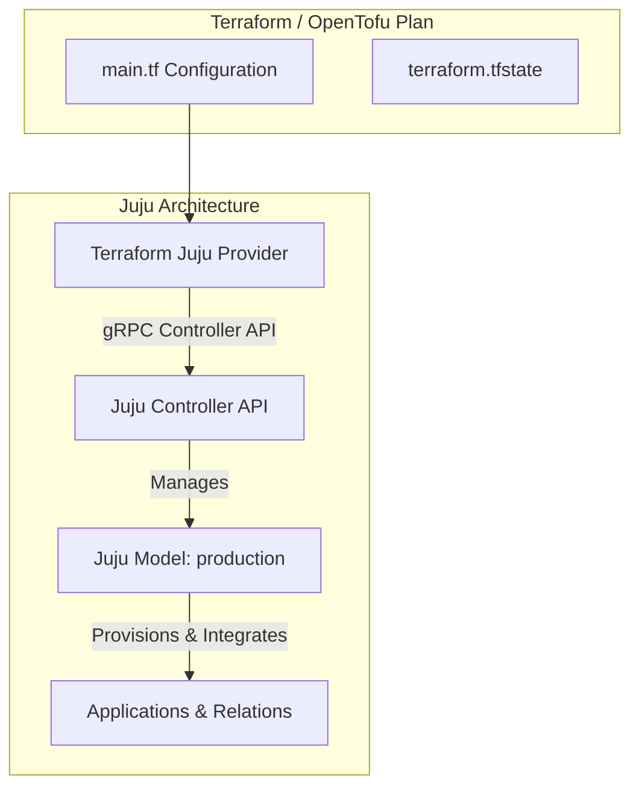

# Managing Juju with Terraform & OpenTofu

While Juju bundles provide simple topology definitions, enterprise infrastructure-as-code (IaC) pipelines often integrate cloud provisioning (AWS, GCP, Azure, OpenStack), DNS records, network subnets, and application charms into unified, version-controlled workflows using **Terraform** or **OpenTofu**.

The official **Terraform Juju Provider** (`juju/juju`) connects Terraform directly to the Juju controller API.



## Configuring the Juju Provider

To configure the provider in HCL:

```hcl
terraform {
  required_providers {
    juju = {
      source  = "juju/juju"
      version = "~> 0.16.0"
    }
  }
}

provider "juju" {
  controller_addresses = ["10.0.4.50:17070"] # or configured via environment / local client
}
```

## Defining Models, Applications & Integrations in HCL

With the Juju provider, all Juju primitives become first-class Terraform resources:

### 1. `juju_model`
Provisions and configures a Juju model:
```hcl
resource "juju_model" "web_tier" {
  name = "production-web"

  config = {
    logging-config = "<root>=INFO;unit=DEBUG"
  }
}
```

### 2. `juju_application`
Deploys charms from Charmhub with channels, units, configuration options, and resources:
```hcl
resource "juju_application" "database" {
  name  = "mysql"
  model = juju_model.web_tier.name

  charm {
    name    = "mysql"
    channel = "8.0/stable"
  }

  units  = 1
  config = {
    database = "ecommerce"
  }
}
```

### 3. `juju_integration`
Establishes relations between deployed applications:
```hcl
resource "juju_integration" "web_to_db" {
  model = juju_model.web_tier.name

  application {
    name     = juju_application.web.name
    endpoint = "db"
  }

  application {
    name     = juju_application.database.name
    endpoint = "database"
  }
}
```

## Managing Offers and Cross-Model Integrations

Terraform supports cross-model offers and cross-model relations using `juju_offer` and `juju_integration`:

```hcl
# Create an offer in the database model
resource "juju_offer" "db_offer" {
  model            = juju_model.database_model.name
  application_name = juju_application.database.name
  endpoint         = "database"
}

# Consume the offer from the frontend model
resource "juju_integration" "frontend_to_db_cmr" {
  model = juju_model.frontend_model.name

  application {
    name     = juju_application.frontend.name
    endpoint = "db"
  }

  application {
    offer_url = juju_offer.db_offer.url
  }
}
```
