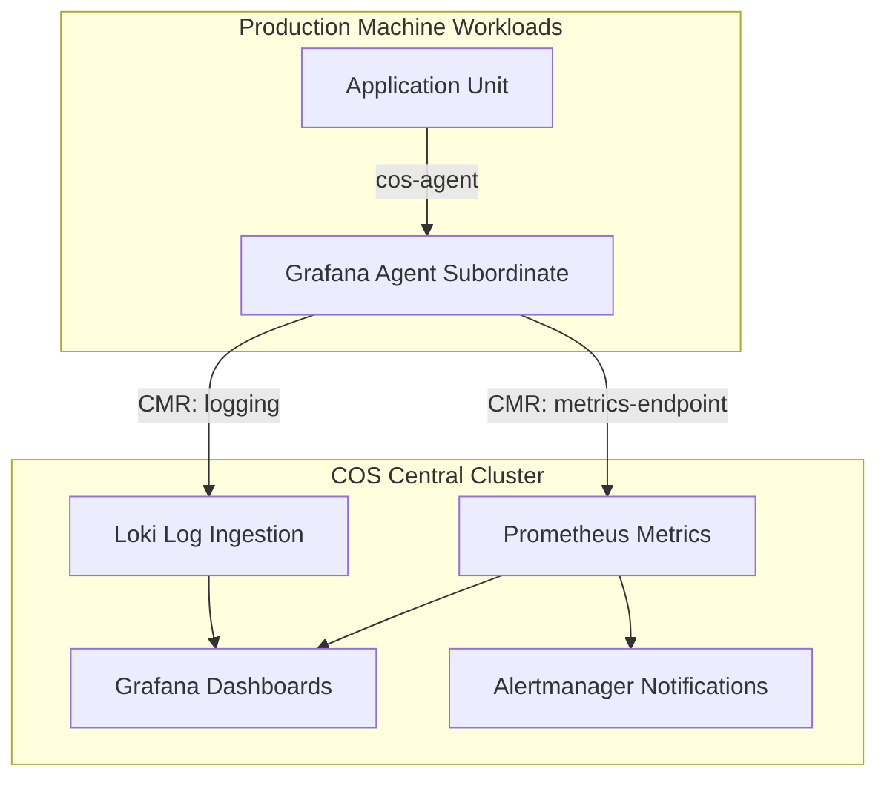

# Monitoring, Telemetry & Production Lifecycle

Continuous production operations depend on comprehensive telemetry, dynamic log verbosity management, proactive alerting, and graceful maintenance modes.

## Real-Time Operational Telemetry with COS

The Canonical Observability Stack (COS) integrates Prometheus, Loki, Alertmanager, Grafana, and Tempo to provide 360-degree observability across machine and Kubernetes workloads.



### Key Production Integration Interfaces:
- **`metrics-endpoint`**: Scrapes OpenMetrics and Prometheus telemetry from charm endpoints.
- **`logging` / `log-proxy`**: Transports structured logs directly into Loki.
- **`grafana-dashboard`**: Injects version-controlled JSON dashboards into Grafana folders dynamically.
- **`alert-rules`**: Distributes charm-defined Prometheus alert expressions automatically.

## Dynamic Logging Configuration

Operators can tune model and controller logging verbosity on the fly without service restarts:

```bash
# View active model logging configuration
juju model-config logging-config

# Tune logging to capture uniter worker traces and unit debug messages
juju model-config logging-config="<root>=INFO;unit=DEBUG;juju.worker.uniter=TRACE"

# Stream live filtered logs
juju debug-log --level DEBUG --include webapp/0

# Replay past logs without blocking
juju debug-log --replay --no-tail -n 100
```

## Production Maintenance & Unit Outages

When performing node maintenance or handling machine failures:

```bash
# Remove an unhealthy machine after re-allocating units
juju remove-machine <id> --force

# Remove a failed unit cleanly
juju remove-unit <app>/<unit-number>

# Retry failed charm hooks during unexpected network or package failures
juju resolved <app>/<unit-number> --retry
```

## Production Operational Checklist

1. **Scheduled Backups**: Run automated nightly controller backups (`juju create-backup`).
2. **Channel Stability**: Pin charms to long-term stable tracks (e.g., `8.0/stable`, `14/stable`).
3. **Subordinate Telemetry**: Ensure all machine units have `grafana-agent` attached for log and metric shipping.
4. **CMR Verification**: Regularly verify cross-model relations and offers (`juju offers`).
