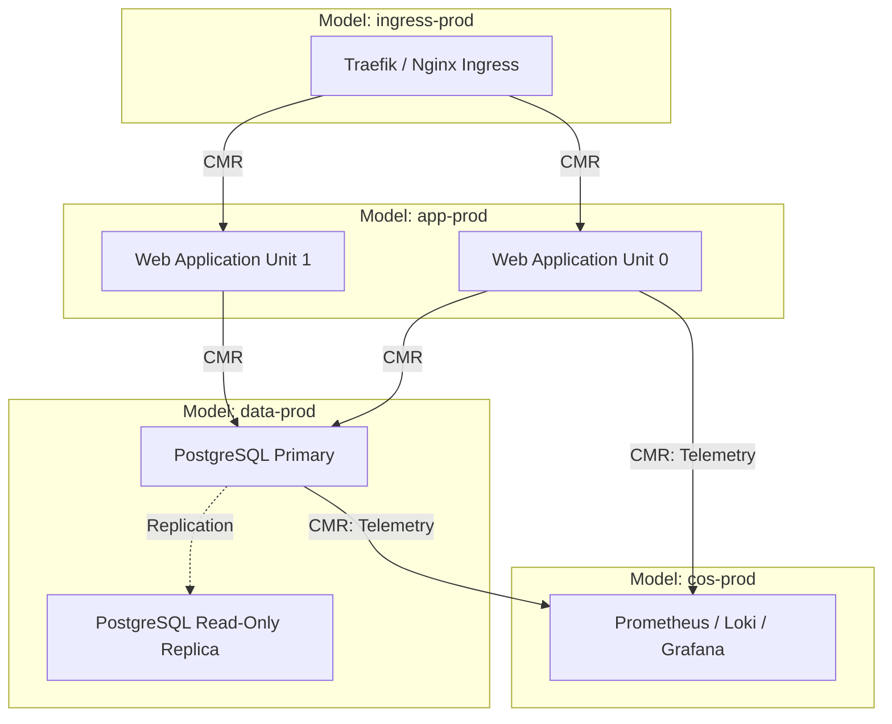

# Production Topologies, CI/CD & Best Practices

Operating Juju in enterprise environments requires structured automation patterns, continuous integration & delivery (CI/CD) pipelines, and adherence to security and operational standards.

## Multi-Tier Architecture Patterns

In production, architectures are typically decoupled into dedicated models to isolate operational failure domains and enforce security boundaries:



## Production Best Practices Checklist

1. **Model Isolation**: Separate database clusters, business logic applications, ingress gateways, and observability components into distinct models.
2. **Charm Upgrades & Channels**: Always specify explicit tracks and risk channels (e.g. `channel = "14/stable"`) to prevent unintended major version jumps during charm refreshes.
3. **Secret Store Integration**: Use external secret stores (Vault / OpenBao) integrated with Juju secrets (`juju add-secret`) rather than plain-text configuration parameters.
4. **Automated Backups & Day-2 Actions**: Schedule routine database backups using Juju actions (`juju run <db>/leader create-backup`) piped into S3/Swift object storage.
5. **Infrastructure Drift Control**: Run scheduled CI jobs (`terraform plan --detailed-exitcode` or `juju status --format json` compliance tests) to detect manual drift.

## CI/CD Automation with GitHub Actions & GitLab CI

Automated testing and deployment pipelines validate charm changes against ephemeral LXD or MicroK8s controllers before promoting to production:

```yaml
# Example GitHub Actions snippet for charm testing
name: Test Charm Deployment
on: [push, pull_request]

jobs:
  validate-topology:
    runs-on: ubuntu-latest
    steps:
      - uses: actions/checkout@v4
      - name: Setup LXD & Juju
        run: |
          sudo snap install lxd --channel=5.21/stable
          sudo lxd init --auto
          sudo snap install juju --classic --channel=3.6/stable
      - name: Bootstrap Ephemeral Controller
        run: |
          juju bootstrap localhost test-controller
      - name: Deploy Bundle & Test
        run: |
          juju deploy ./bundle.yaml --wait 10m
          juju status --format yaml
```

## Troubleshooting Production Incidents

- **Unresponsive Units**: Check agent logs via `juju exec --unit <app>/<n> 'journalctl -u jujud-unit-* -n 50'`.
- **Blocked Status**: Inspect status messages (`juju status`) and resolve missing integrations or invalid configuration options.
- **Hook Failures**: Use `juju debug-hooks` to intercept and `juju resolved --retry` once dependencies are restored.
