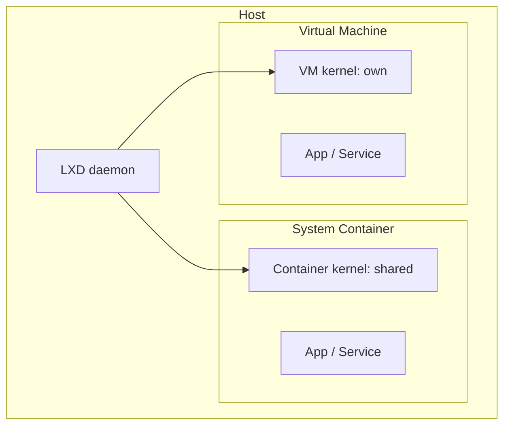

# What is LXD?

LXD is a modern, secure, and powerful **system container and virtual machine
manager**. It provides a unified experience for running and managing full Linux
systems inside containers or virtual machines.

## Key concepts

| Concept | Description |
|---------|-------------|
| **LXD** | The daemon (background service) that manages containers and VMs. |
| **lxc** | The command-line client used to talk to the LXD daemon. |
| **Instance** | A running Linux system — either a container or a virtual machine. |
| **Container** | A lightweight system container that shares the host kernel. |
| **VM** | A full virtual machine with its own kernel, booted via KVM. |
| **Image** | A template used to create instances (like a VM template or Docker image). |
| **Profile** | A reusable set of configuration options applied to instances. |
| **Project** | A namespace that groups instances, images, and profiles. |
| **Storage pool** | Where instance disks and images live (ZFS, Btrfs, LVM, dir, etc.). |
| **Network** | A bridge or OVN network that instances connect to. |

## Containers vs Virtual Machines

| | System Containers | Virtual Machines |
|---|---|---|
| **Kernel** | Shared with host | Own kernel |
| **Boot time** | Seconds | Minutes |
| **Resource usage** | Low | Higher |
| **Isolation** | Process-level | Hardware-level |
| **Use case** | Running full Linux systems efficiently | When you need a different kernel or stronger isolation |

LXD system containers are **not** like Docker application containers. A LXD
container runs a full Linux system — it has `init`, `systemd`, users, packages,
and behaves like a VM but without the overhead of a separate kernel.

## lxd vs lxc

A common source of confusion:

- **`lxd`** — the **daemon**. You interact with it indirectly. You run
  `lxd init` to initialize it, but you don't use `lxd` for day-to-day operations.
- **`lxc`** — the **client**. You use `lxc` to create, start, stop, configure,
  and manage instances. This is the command you'll use throughout this course.

## The REST API

LXD is built around a **REST API**. Every `lxc` command translates to an API
call. This means you can manage LXD remotely over the network — the same API
works whether you're on the same machine or across a data center.

## Clustering

LXD scales from a single instance on your laptop to a **cluster** spanning an
entire data center rack. Multiple LXD servers can join a cluster, and instances
are distributed across them. You'll learn about clustering in advanced modules.

## Next steps

In the next lecture, we'll install LXD using snap and initialize it with a
minimal configuration. Then we'll launch our first instance.
