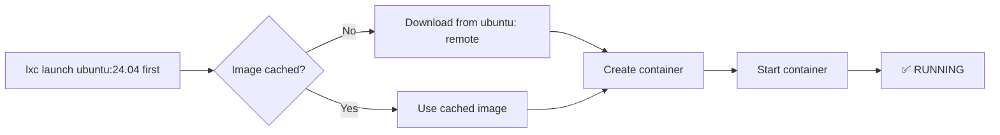

# Your First Instance

Now that LXD is installed and initialized, let's create and manage your first
instance.

## Launching a container

The `lxc launch` command creates an instance **and** starts it immediately:

```bash
lxc launch ubuntu:24.04 first
```

This command:
1. Downloads the Ubuntu 24.04 LTS image from the `ubuntu:` remote server
2. Creates a container named `first`
3. Starts it

The first launch takes longer because it downloads the image. Subsequent
instances from the same image use the cached copy and are much faster.

## Creating without starting

Use `lxc init` to create an instance without starting it:

```bash
lxc init ubuntu:24.04 second
```

The instance `second` is created but stays in `STOPPED` state.

## Listing instances

```bash
lxc list
```

Output:

```
+--------+---------+---------------------+------+-----------+-----------+
| NAME   | STATE   | IPV4                | TYPE | SNAPSHOTS | CREATED AT|
+--------+---------+---------------------+------+-----------+-----------+
| first  | RUNNING | 10.10.10.10 (eth0) | ...  | 0         | ...       |
| second | STOPPED |                     | ...  | 0         | ...       |
+--------+---------+---------------------+------+-----------+-----------+
```

## Instance information

Get detailed info about a specific instance:

```bash
lxc info first
```

This shows architecture, PID, CPU usage, memory usage, disk usage, network
configuration, and more.

## Starting and stopping

```bash
lxc start second      # start a stopped instance
lxc stop first        # stop a running instance
lxc restart first     # restart an instance
```

## Launching a virtual machine

To create a VM instead of a container, add the `--vm` flag:

```bash
lxc launch ubuntu:24.04 ubuntu-vm --vm
```

VMs have their own kernel and stronger isolation, but take longer to start
and use more resources.



## Deleting instances

Stop an instance before deleting it (or use `--force`):

```bash
lxc stop first
lxc delete first

# Or force delete without stopping:
lxc delete first --force
```

> **Warning**: Deleting an instance is irreversible. All snapshots and data
> associated with the instance are lost.

## Next steps

In the next module, we'll dive deeper into instance management — configuration,
shell access, file transfer, and snapshots.
