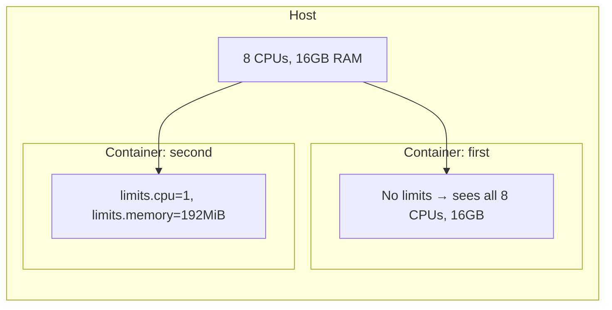

# Configuring Instances

Each instance inherits a default set of configuration options. You can
customize these at creation time or after the instance is running.

## Viewing configuration

```bash
# View all configuration for an instance
lxc config show first

# Get a specific config value
lxc config get first limits.memory
```

## Setting configuration

```bash
# Set a single value
lxc config set first limits.cpu=2

# Set multiple values at once
lxc config set first limits.cpu=1 limits.memory=192MiB
```

## Common configuration options

| Option | Description | Example |
|--------|-------------|---------|
| `limits.cpu` | Number of CPUs | `limits.cpu=2` |
| `limits.memory` | Memory limit | `limits.memory=512MiB` |
| `limits.disk` | Disk quota | `limits.disk=5GiB` |
| `limits.processes` | Max processes | `limits.processes=100` |
| `boot.autostart` | Start on host boot | `boot.autostart=true` |
| `security.privileged` | Run privileged | `security.privileged=true` |

## Adding devices

Instances can have devices attached — disks, network interfaces, GPUs, USB
devices, etc.

```bash
# Add a shared directory from the host
lxc config device add first share disk \
  source=/home/user/shared \
  path=/mnt/shared

# Add a NIC (network interface)
lxc config device add first eth1 nic \
  nictype=bridged \
  parent=lxdbr0
```

## Removing configuration

```bash
# Remove a specific config key (revert to default)
lxc config unset first limits.cpu
```

## Editing configuration directly

```bash
# Opens the full config in your editor
lxc config edit first
```

## Resource limits in practice

By default, containers inherit all host resources. Setting limits constrains
what the container can use:



Inside `first`, `nproc` shows all host CPUs. Inside `second`, `nproc` shows 1
and `free -m` shows 192MB — because we set those limits.

## Next steps

Now let's learn how to get a shell inside an instance and run commands.
