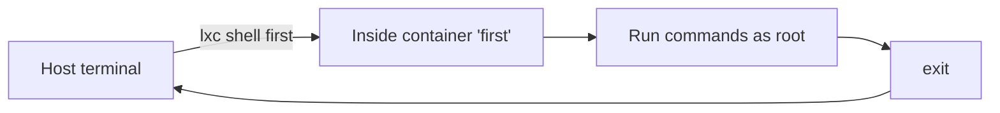

# Shell Access & Running Commands

LXD provides two ways to interact with the inside of an instance: `lxc shell`
for an interactive session and `lxc exec` for running a single command.

## Interactive shell

```bash
lxc shell first
```

This opens an interactive shell (as root) inside the `first` container. Your
prompt changes to indicate you're inside the instance. Type `exit` to leave.



## Running a single command

```bash
lxc exec first -- free -m
lxc exec first -- nproc
lxc exec first -- cat /etc/os-release
```

`lxc exec` runs a single command inside the instance and returns the output
to your host terminal. No interactive shell is opened.

## The `--` separator

The `--` separates `lxc` arguments from the command to run inside the
instance. This prevents flags from being interpreted by `lxc` instead of the
inner command:

```bash
# Correct: -- separates lxc flags from the command
lxc exec first -- ls -la /tmp

# Without --, lxc might interpret -la as its own flag
lxc exec first ls -la /tmp  # may not work as expected
```

## Running commands as a specific user

```bash
# Run as the 'ubuntu' user
lxc exec first -- su - ubuntu -c "whoami"
```

## Interactive commands

`lxc exec` can also run interactive commands (like `bash`):

```bash
lxc exec first -- bash
```

This is essentially what `lxc shell` does internally.

## Comparing shell vs exec

| | `lxc shell` | `lxc exec` |
|---|---|---|
| **Purpose** | Interactive shell session | Single command |
| **User** | root | root (or specify with su) |
| **Use case** | Exploring, installing packages | Quick checks, scripting |
| **Returns** | Opens a shell | Returns output, exits |

## Practical examples

```bash
# Install a package inside a container
lxc exec first -- apt update
lxc exec first -- apt install -y nginx

# Check the OS version
lxc exec first -- cat /etc/*release

# Create a file inside the container
lxc exec first -- touch /tmp/hello.txt
```

## Next steps

Next, we'll learn how to transfer files between the host and instances, and
how to create snapshots for backup and restore.
