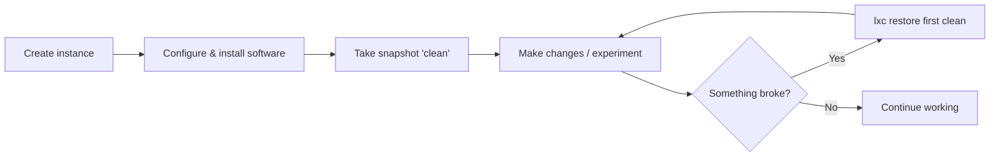

# Files & Snapshots

## Accessing files

LXD provides `lxc file` commands to push, pull, and manipulate files
between the host and instances.

### Push a file into an instance

```bash
# Create a file on the host
echo "Hello world" > helloworld.txt

# Push it into the 'first' container
lxc file push helloworld.txt first/root/helloworld.txt
```

### Pull a file from an instance

```bash
lxc file pull first/root/helloworld.txt .
```

### Create a directory inside an instance

```bash
lxc file push --create-directory first/root/mydir
```

### Edit a file inside an instance

```bash
lxc file edit first/root/helloworld.txt
```

## Snapshots

Snapshots save the complete state of an instance at a point in time. You can
restore to a snapshot later if something goes wrong.

### Creating a snapshot

```bash
lxc snapshot first clean
```

This creates a snapshot named `clean` of the `first` container.

### Viewing snapshots

```bash
# List snapshots (shown in the SNAPSHOTS column)
lxc list first

# Detailed snapshot info
lxc info first
```

### Restoring a snapshot

```bash
lxc restore first clean
```

The instance reverts to the state it was in when the `clean` snapshot was
taken.

### Deleting a snapshot

```bash
lxc delete first/clean
```

## Snapshot workflow



## Practical example

```bash
# Create a snapshot before making changes
lxc snapshot first clean

# Break something on purpose
lxc exec first -- rm /usr/bin/bash

# This now fails:
lxc exec first -- bash
# Error: exec failed: ...

# Restore from snapshot
lxc restore first clean

# Now it works again:
lxc exec first -- bash
# (bash shell opens)
exit
```

## Next steps

In the next module, we'll explore LXD images — how to find, manage, and
create your own images.
