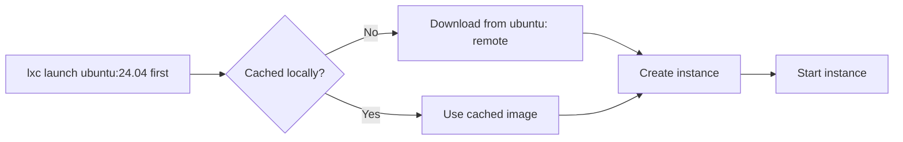

# Remote Image Servers

LXD uses **images** to create instances. Images are templates — a filesystem
snapshot and metadata that LXD uses to create a new container or VM.

## Where images come from

LXD can pull images from **remote image servers**. The two most common are:

| Remote | URL | Contents |
|--------|-----|----------|
| `ubuntu:` | cloud-images.ubuntu.com | Official Ubuntu releases (LTS and non-LTS) |
| `images:` | images.lxd.canonical.com | Community images — many Linux distros, desktop variants |

## Listing remote images

```bash
# List Ubuntu images on the ubuntu: remote
lxc image list ubuntu:

# Search for a specific Ubuntu version
lxc image list ubuntu:24.04

# List images on the images: remote
lxc image list images:

# Search for Alpine images
lxc image list images:alpine
```

## Image naming

Remote images are referenced as `<remote>:<image>`:

```bash
# Ubuntu 24.04 LTS from the ubuntu: remote
lxc launch ubuntu:24.04 my-container

# Debian 12 from the images: remote
lxc launch images:debian/12 my-debian

# Alpine 3.20 from the images: remote
lxc launch images:alpine/3.20 my-alpine
```

## Image caching

When you launch an instance from a remote image, LXD downloads it and caches
it locally. Subsequent launches from the same image use the cached copy and
are much faster.



## Listing local (cached) images

```bash
lxc image list
```

This shows all images cached on your local LXD server, including their
fingerprints, aliases, and size.

## Image fingerprints

Every image has a unique **fingerprint** (a hash). You can reference an image
by its fingerprint or its alias:

```bash
# By alias
lxc launch ubuntu:24.04 my-container

# By fingerprint (partial match works)
lxc launch ubuntu:abc123def456 my-container
```

## Adding remote servers

You can add additional remote image servers:

```bash
lxc remote add my-server https://my-server.com:8443
lxc image list my-server:
```

## Next steps

Now let's learn how to manage the images cached on your local LXD server.
