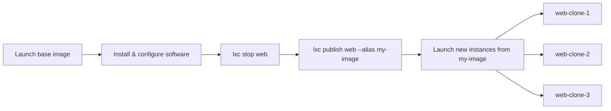

# Creating Images

You can create your own custom images from existing instances or snapshots.
This is useful when you've configured an instance with specific software and
want to reuse it as a template.

## Publishing an instance as an image

```bash
# Stop the instance first (required for containers)
lxc stop web

# Publish it as a new image with an alias
lxc publish web --alias my-web-image
```

This creates a new local image from the current state of the `web` container.
The image gets a fingerprint and the alias `my-web-image`.

## Publishing from a snapshot

```bash
lxc publish web/clean --alias clean-web-image
```

This creates an image from the `clean` snapshot of the `web` container —
without needing to stop or modify the running instance.

## Publishing with properties

```bash
lxc publish web --alias my-web-image \
  --property description="Web server with nginx pre-installed" \
  --property os=ubuntu \
  --property release=24.04
```

## Launching from a custom image

Once you've published a custom image, you can launch new instances from it:

```bash
lxc launch my-web-image web-clone-1
lxc launch my-web-image web-clone-2
```

Each new instance starts with the same software and configuration as the
original `web` container when the image was created.

## Image creation workflow



## Copying images between servers

If you have multiple LXD servers, you can copy images between them:

```bash
# Copy a local image to a remote server
lxc image copy my-web-image remote-server:

# Copy a remote image to your local server
lxc image copy remote-server:their-image local: --alias my-copy
```

## Summary

Throughout this course, you've learned:

1. **What LXD is** — a system container and VM manager
2. **Installation & initialization** — snap install, lxd init
3. **Instances** — creating, configuring, shelling into, and managing containers and VMs
4. **Files & snapshots** — pushing/pulling files and backup/restore
5. **Images** — using remote images, managing local images, and creating custom images

LXD is a powerful tool that scales from your laptop to a full data center.
Continue exploring the [LXD documentation](https://canonical.com/lxd/docs) for
advanced topics like storage, networking, clustering, and the REST API.
