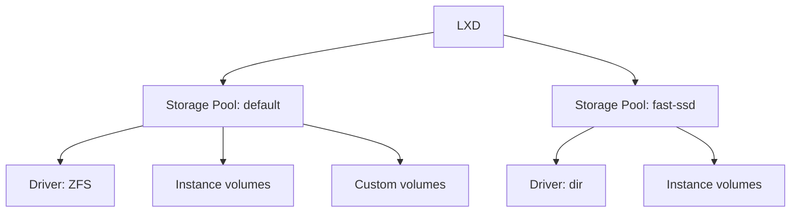

# Storage Pools & Drivers

When you create an instance, LXD needs somewhere to store its disk. That
somewhere is a **storage pool** — a backing store managed by a **storage
driver**.

## What is a storage pool?

A storage pool is a named storage area that LXD manages. When you ran
`lxd init --minimal`, LXD created a default pool for you (usually ZFS-backed).

```bash
lxc storage list
```

This shows all pools on your server, their driver, and usage.

## Storage drivers

LXD supports multiple storage drivers. Each has different trade-offs:

| Driver | Description | Best for |
|--------|-------------|----------|
| **ZFS** | ZFS filesystem with snapshots, compression, copy-on-write | Default, recommended for most setups |
| **Btrfs** | Btrfs subvolumes with snapshots | Good performance, native snapshots |
| **LVM** | Logical Volume Manager with thin provisioning | When ZFS/Btrfs unavailable |
| **dir** | Plain directory on the host filesystem | Simplest, no special filesystem needed |
| **Ceph RBD** | Distributed block storage via Ceph | Clusters, shared storage |



## Viewing pool details

```bash
# Show configuration of a specific pool
lxc storage show default

# Show usage info (space used, total)
lxc storage info default
```

## Creating a new storage pool

You can add more pools using different drivers:

```bash
# Create a simple directory-backed pool
lxc storage create my-pool dir

# Create a ZFS pool (loop-backed)
lxc storage create my-zfs zfs
```

## Why multiple pools?

Different workloads benefit from different storage:

- **Fast SSD pool** for databases and I/O-heavy instances
- **Large HDD pool** for backups and archival
- **Shared Ceph pool** for cluster deployments

You can specify which pool an instance uses at creation time:

```bash
lxc launch ubuntu:24.04 db --storage my-zfs
```

## Next steps

Now that you understand storage pools, let's look at storage volumes — the
individual disks that instances and custom data live on.
