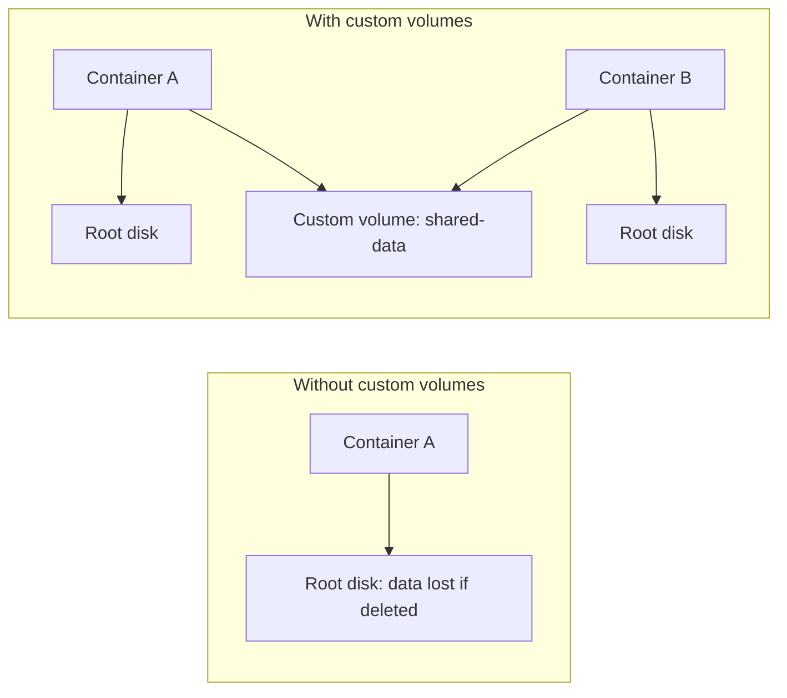

# Storage Volumes

Every instance has a **root disk volume** — that's where its filesystem lives.
But you can also create **custom volumes** — independent storage that can be
attached to instances, shared between them, or used for backups.

## Types of storage volumes

| Type | Description |
|------|-------------|
| **container** | Root disk for a container (auto-created) |
| **virtual-machine** | Root disk for a VM (auto-created) |
| **image** | Cached image data (auto-created) |
| **custom** | User-created volume for shared data |

## Listing volumes

```bash
# List all volumes across all pools
lxc storage volume list

# List volumes in a specific pool
lxc storage volume list default
```

The output shows the volume type, content type (filesystem or block), and
which pool each volume belongs to.

## Creating a custom volume

Custom volumes are independent of instances — they persist even after the
instance is deleted:

```bash
# Create a 1 GiB custom volume named 'shared-data' in the default pool
lxc storage volume create default shared-data size=1GiB
```

## Attaching a custom volume to an instance

Once created, you can attach a custom volume to an instance as a disk device:

```bash
# Attach 'shared-data' to container 'web' at /mnt/data
lxc storage volume attach default shared-data web /mnt/data
```

Now inside the `web` container, `/mnt/data` is backed by the custom volume.
Files written there persist independently of the container's root disk.

## Detaching a custom volume

```bash
lxc storage volume detach default shared-data web
```

## Deleting a custom volume

```bash
lxc storage volume delete default shared-data
```

> **Note**: You can't delete a volume that's still attached to an instance.
> Detach it first.

## Why use custom volumes?



- **Data persistence**: Survive instance deletion
- **Sharing**: Mount the same data in multiple containers
- **Independent backups**: Back up data without the instance
- **Migration**: Move data between instances

## Next steps

Now let's get hands-on with storage pools and volumes in the lab.
