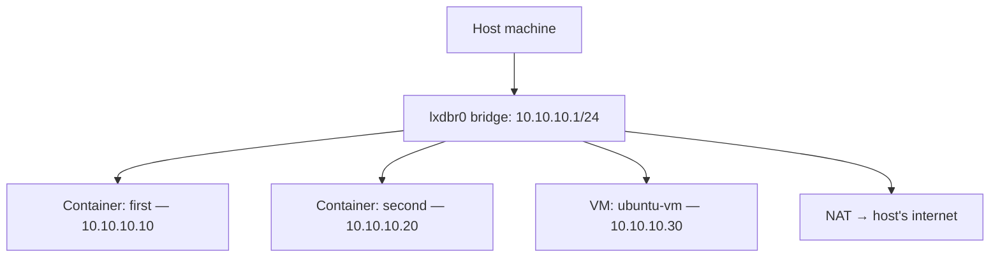

# Networks in LXD

When you launch an instance, it needs network connectivity. LXD manages
this through **networks** — virtual switches that instances connect to.

## The default network

When you ran `lxd init --minimal`, LXD created a default bridge network
called `lxdbr0`. Every instance connects to this network by default.

```bash
# List all networks
lxc network list

# Show details of the default network
lxc network show lxdbr0
```

## How bridge networking works

A bridge is like a virtual switch. LXD creates it on the host, and each
instance gets a virtual NIC (network interface) connected to it:



- LXD runs a **DHCP server** on the bridge, assigning IPs automatically
- **NAT** routes outbound traffic through the host's internet connection
- Instances can communicate with each other on the bridge subnet
- The host can reach instances directly at their bridge IPs

## Network types

| Type | Description | Use case |
|------|-------------|----------|
| **bridge** | Virtual switch with DHCP/NAT | Default, most common |
| **macvlan** | Instances get their own MAC on the physical network | When instances need to be on the LAN directly |
| **OVN** | Software-defined networking across a cluster | Advanced, cluster setups |
| **physical** | Direct pass-through of a host NIC | Specialized networking |

## Creating a new bridge network

```bash
lxc network create my-bridge \
  --type=bridge \
  ipv4.address=10.20.20.1/24 \
  ipv4.nat=true
```

This creates a new bridge with a different subnet. You might want separate
networks for different environments (e.g., dev vs. test).

## Viewing instance network info

```bash
# See IP addresses assigned to an instance
lxc list

# Get detailed network info
lxc info first
```

The `IPV4` column in `lxc list` shows the instance's IP on the bridge.

## Next steps

Now let's get hands-on with networks — creating a new bridge and connecting
instances to it.
